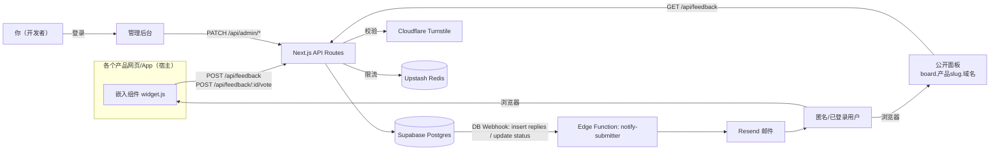
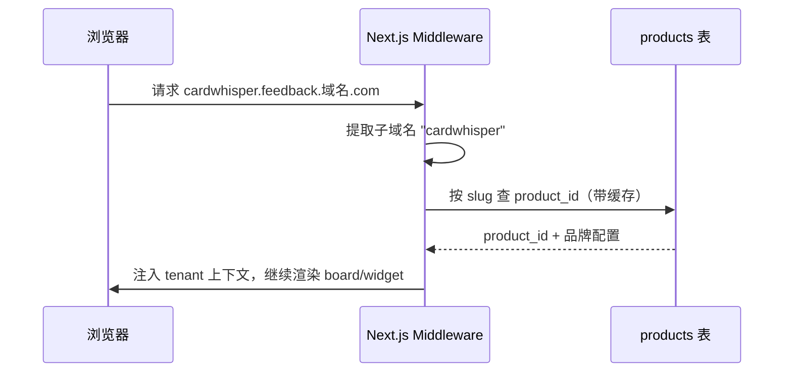

# 架构设计

## 系统上下文

## 模块边界（高内聚低耦合）

| 模块 | 职责 | 不做什么 | 依赖方向 |
|---|---|---|---|
| **widget**（嵌入组件） | 渲染提交表单、调用公开 API | 不直接连数据库，不知道管理后台的存在 | 只依赖 `packages/core` 的类型/校验 schema |
| **board**（公开面板） | 按租户展示反馈列表、投票、状态、回复 | 不包含任何管理态操作（改状态、写回复） | 依赖 `core`，通过 API Routes 读写 |
| **admin**（管理后台） | 改状态、写回复、跨产品统一收件箱视图 | 不直接处理邮件发送（见下方事件驱动设计） | 依赖 `core`，需要登录态 |
| **API Routes** | 请求校验（含防刷）、租户解析、数据库读写 | 不负责邮件发送、不负责判重计算（判重是后续阶段独立模块） | 依赖 `core`，依赖 Supabase client |
| **notify-submitter**（Edge Function） | 监听 DB 事件，组装并发送通知邮件 | 不被业务代码直接调用，只响应 DB Webhook | 依赖 `core`，依赖 Resend |
| **tenant-resolver**（中间件） | 将请求的子域名/slug 解析为 `product_id` | 不做权限校验（权限是 RLS 和 API 层各自的职责） | 被 board/widget/admin 共用 |

**关键解耦点**：管理员在后台写回复，只是往 `replies` 表插入一行数据；"发一封邮件通知用户"这个副作用，是数据库变更事件触发 Edge Function 去做的，业务代码本身完全不知道"发邮件"这件事的存在。好处：

- 以后想加"回复时同步发 Slack 通知"，只需要另加一个监听同一个事件的 Edge Function，不用改动写回复的代码
- 通知逻辑的 bug 不会影响核心的读写操作（两者是独立的执行单元，一个挂了不影响另一个）

## 多租户路由设计

参考 Fider 的思路：一套代码，通过子域名映射到 `product_id`。

本地开发和测试环境通过环境变量 `DEFAULT_TENANT_SLUG` 兜底，不依赖真实子域名。

## 跨产品统一收件箱

管理后台默认视图是"全部产品"，按 `product_id` 聚合展示所有反馈，可切换到单产品视图。这是与 Fider/Astuto/Quackback 的核心场景差异——它们假设"一个部署=一个产品/一个组织"，本项目假设"一个部署=开发者名下所有产品"，因此：

- `feedback` 查询默认不带 `product_id` 过滤，管理后台是唯一的"上帝视角"入口
- board/widget 必须带 `product_id` 过滤（租户隔离在这两个面向终端用户的模块是强制的，在管理后台是可选的）

## 关键数据流

### 提交反馈

1. widget 收集表单内容（含蜜罐字段）+ Turnstile token
2. API Route 校验 `core` 中的 zod schema（先解出字段才有蜜罐值可查）→ 蜜罐非空则静默假成功返回 → 校验 Turnstile → 检查 Redis 频率限制（按 IP hash）→ 按 `productSlug` 解析租户 → 写入 `feedback` 表
3. 返回结果给 widget，不触发任何通知（首次提交无需通知提交者本人）

### 投票

1. widget/board 提交 `feedback_id` 所属租户的 `productSlug` + `voter_email` + Turnstile token（投票门槛比提交反馈低，但仍需基础校验防止脚本刷票）
2. API Route 校验后，二次核对该 `feedback_id` 确实属于 `productSlug` 解析出的租户（防止跨租户猜测 id 投票），再向 `votes` 表插入一行，利用 `(feedback_id, voter_email)` 唯一约束天然去重，冲突时返回"已投过票"而不是报错中断

### 管理员回复 / 状态变更

1. admin 调用 `PATCH /api/admin/feedback/:id`（改状态）或 `POST /api/admin/feedback/:id/reply`（写回复）
2. 写入成功后事务提交，不在这一步调用任何邮件逻辑
3. Supabase DB Webhook 检测到 `replies` 表 insert 或 `feedback.status` 变更，异步调用 `notify-submitter` Edge Function
4. Edge Function 查出该反馈的提交者邮箱，调用 Resend 发送通知

## 安全边界

- **RLS（Row Level Security）**：`feedback`/`votes`/`replies` 对匿名角色只开放 `select` 和受限的 `insert`（不能改 `status`、不能插入 `is_admin=true` 的回复），改状态和写管理员回复只能通过 service-role 密钥（仅服务端 API Route 持有）执行。权限边界下沉到数据层，而不是只靠前端隐藏按钮。
- **防刷三层**：蜜罐字段（拦截无脑脚本）→ Turnstile（拦截自动化工具）→ IP 频率限制（拦截绕过前两者的高频请求），三层是独立的中间件函数，任意一层都可以单独禁用/替换而不影响另外两层。
