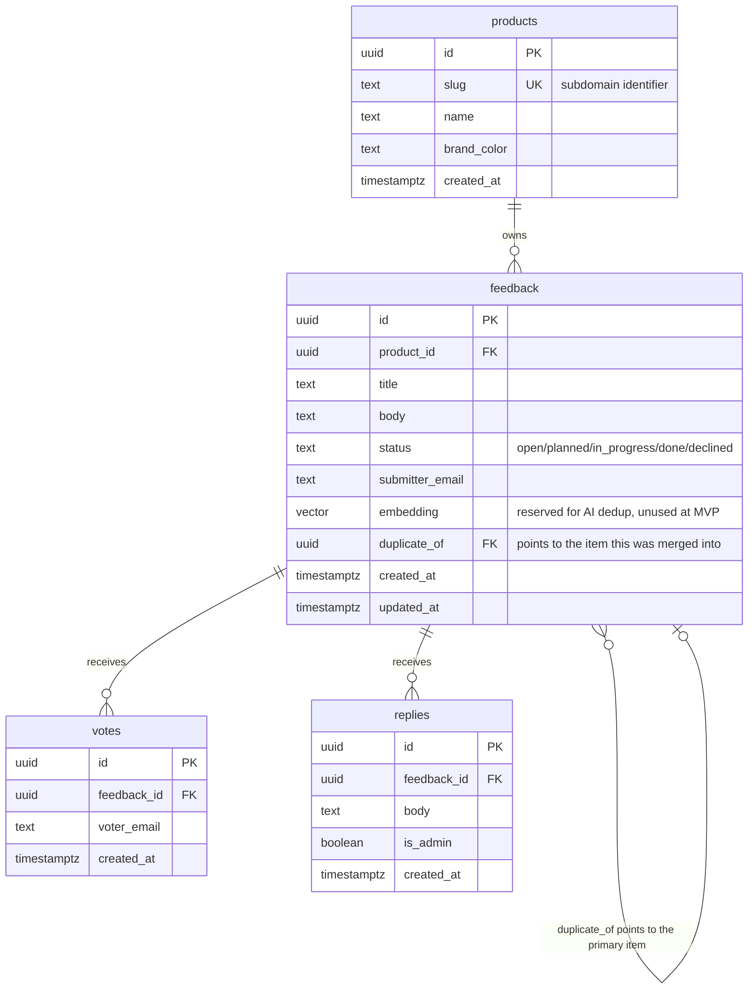
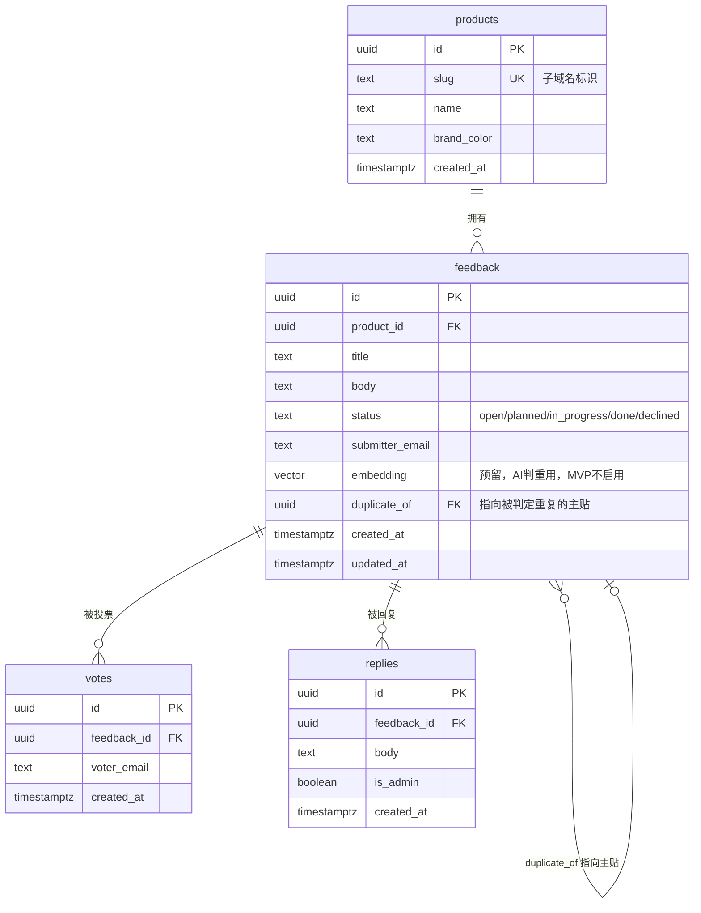

# Data Model

## ER diagram



## DDL

```sql
create extension if not exists "uuid-ossp";
create extension if not exists vector; -- reserved for pgvector, unused at the MVP stage

create table products (
  id uuid primary key default gen_random_uuid(),
  slug text unique not null,          -- used for subdomain/route matching, e.g. 'cardwhisper'
  name text not null,
  brand_color text,
  created_at timestamptz not null default now()
);

create table feedback (
  id uuid primary key default gen_random_uuid(),
  product_id uuid not null references products(id) on delete cascade,
  title text not null,
  body text,
  status text not null default 'open'
    check (status in ('open','planned','in_progress','done','declined')),
  submitter_email text not null,
  embedding vector(1536),             -- enabled in Roadmap Phase 3
  duplicate_of uuid references feedback(id),
  created_at timestamptz not null default now(),
  updated_at timestamptz not null default now()
);

create table votes (
  id uuid primary key default gen_random_uuid(),
  feedback_id uuid not null references feedback(id) on delete cascade,
  voter_email text not null,
  created_at timestamptz not null default now(),
  unique (feedback_id, voter_email)   -- the sole basis for vote deduplication
);

create table replies (
  id uuid primary key default gen_random_uuid(),
  feedback_id uuid not null references feedback(id) on delete cascade,
  body text not null,
  is_admin boolean not null default true,
  created_at timestamptz not null default now()
);

-- indexes
create index idx_feedback_product_status on feedback(product_id, status);
create index idx_votes_feedback on votes(feedback_id);
create index idx_replies_feedback on replies(feedback_id);
```

> Rate limiting doesn't live in a Postgres table — it uses Upstash Redis sliding-window counters (see the anti-abuse design in ARCHITECTURE.md), avoiding the need for an extra data-cleanup job.

## Row Level Security policies

```sql
alter table feedback enable row level security;
alter table votes enable row level security;
alter table replies enable row level security;

-- the anonymous role can read all feedback (board/widget filter by product_id in the application layer)
create policy "anon can read feedback" on feedback
  for select using (true);

-- the anonymous role can only insert, never change status / duplicate_of
create policy "anon can submit feedback" on feedback
  for insert with check (true);

-- status changes and dedup assignment can only be done by the service role (simply don't grant anon an update policy)

create policy "anon can read votes" on votes
  for select using (true);

create policy "anon can vote" on votes
  for insert with check (true);

create policy "anon can read replies" on replies
  for select using (true);

-- writing an admin reply (is_admin = true) has no anon policy — only the service role can do it
```

## Grants

RLS policies decide *which rows* a role can touch; they don't grant access to the table at all — that's a separate, more basic Postgres permission. Some Supabase project configurations don't automatically grant `service_role` privileges on newly created tables, which shows up as `permission denied for table X` even though `service_role` is supposed to bypass RLS entirely. This must run after the tables exist:

```sql
grant usage on schema public to service_role, anon, authenticated;

grant all on all tables in schema public to service_role;
grant all on all sequences in schema public to service_role;

-- anon/authenticated privileges mirror the RLS policies above:
-- read everything, insert into feedback/votes, never change status or write an admin reply
grant select on public.products to anon, authenticated;
grant select, insert on public.feedback to anon, authenticated;
grant select, insert on public.votes to anon, authenticated;
grant select on public.replies to anon, authenticated;
```

## Additional field notes

- `submitter_email` / `voter_email`: there's no account system — the email address is the identity. For a user already logged into the host product, the host page pre-fills the email when it initializes the widget (see the widget init params in API.md); logged-out users type it in manually.
- `embedding`: this column stays empty throughout the MVP. When AI dedup ships in Roadmap Phase 3, a background job backfills historical rows before incremental maintenance begins.
- `duplicate_of`: points to the primary item once a duplicate has been manually confirmed. List queries filter out rows where `duplicate_of is not null` by default, and votes/comments are rolled up into the primary item when displayed.

---

# 数据模型（中文）

## ER 图



## DDL

```sql
create extension if not exists "uuid-ossp";
create extension if not exists vector; -- 预留 pgvector，MVP 阶段不使用

create table products (
  id uuid primary key default gen_random_uuid(),
  slug text unique not null,          -- 子域名/路由匹配用，如 'cardwhisper'
  name text not null,
  brand_color text,
  created_at timestamptz not null default now()
);

create table feedback (
  id uuid primary key default gen_random_uuid(),
  product_id uuid not null references products(id) on delete cascade,
  title text not null,
  body text,
  status text not null default 'open'
    check (status in ('open','planned','in_progress','done','declined')),
  submitter_email text not null,
  embedding vector(1536),             -- Roadmap Phase 3 启用
  duplicate_of uuid references feedback(id),
  created_at timestamptz not null default now(),
  updated_at timestamptz not null default now()
);

create table votes (
  id uuid primary key default gen_random_uuid(),
  feedback_id uuid not null references feedback(id) on delete cascade,
  voter_email text not null,
  created_at timestamptz not null default now(),
  unique (feedback_id, voter_email)   -- 投票去重的唯一依据
);

create table replies (
  id uuid primary key default gen_random_uuid(),
  feedback_id uuid not null references feedback(id) on delete cascade,
  body text not null,
  is_admin boolean not null default true,
  created_at timestamptz not null default now()
);

-- 索引
create index idx_feedback_product_status on feedback(product_id, status);
create index idx_votes_feedback on votes(feedback_id);
create index idx_replies_feedback on replies(feedback_id);
```

> 频率限制不落 Postgres 表，走 Upstash Redis 的滑动窗口计数（见 ARCHITECTURE.md 防刷设计），避免为限流引入额外的数据清理任务。

## Row Level Security 策略

```sql
alter table feedback enable row level security;
alter table votes enable row level security;
alter table replies enable row level security;

-- 匿名角色可读所有反馈（board/widget 用 product_id 在应用层过滤租户）
create policy "anon can read feedback" on feedback
  for select using (true);

-- 匿名角色只能插入，不能改 status / duplicate_of
create policy "anon can submit feedback" on feedback
  for insert with check (true);

-- 状态变更、判重指派只能由 service-role 执行（不给 anon 开 update 策略即可）

create policy "anon can read votes" on votes
  for select using (true);

create policy "anon can vote" on votes
  for insert with check (true);

create policy "anon can read replies" on replies
  for select using (true);

-- 写入管理员回复（is_admin = true）不给 anon 开策略，只能 service-role 执行
```

## 权限授予（GRANT）

RLS policy 决定的是"这个角色能碰哪些行"，跟"这个角色能不能碰这张表"是两回事，后者是更基础的 Postgres 权限。有些 Supabase 项目配置下，新建的表不会自动给 `service_role` 授权，即便 `service_role` 理论上应该绕过 RLS——症状是报 `permission denied for table X`。建表之后要补跑这个：

```sql
grant usage on schema public to service_role, anon, authenticated;

grant all on all tables in schema public to service_role;
grant all on all sequences in schema public to service_role;

-- anon/authenticated 的权限跟上面的 RLS policy 对应：
-- 能读全部、能插入 feedback/votes，不能改 status、不能写管理员回复
grant select on public.products to anon, authenticated;
grant select, insert on public.feedback to anon, authenticated;
grant select, insert on public.votes to anon, authenticated;
grant select on public.replies to anon, authenticated;
```

## 字段说明补充

- `submitter_email` / `voter_email`：不做账号体系，邮箱即身份。已登录宿主产品的用户，由宿主页面在初始化 widget 时预填邮箱（见 API.md 的 widget 初始化参数），未登录用户手动输入。
- `embedding`：MVP 阶段该列始终为空，Roadmap Phase 3 启用 AI 判重时，由后台任务统一回填历史数据后开始增量维护。
- `duplicate_of`：人工确认判重后指向的主贴 id；查询列表时默认过滤掉 `duplicate_of is not null` 的记录，票数/评论在展示时归并到主贴。
